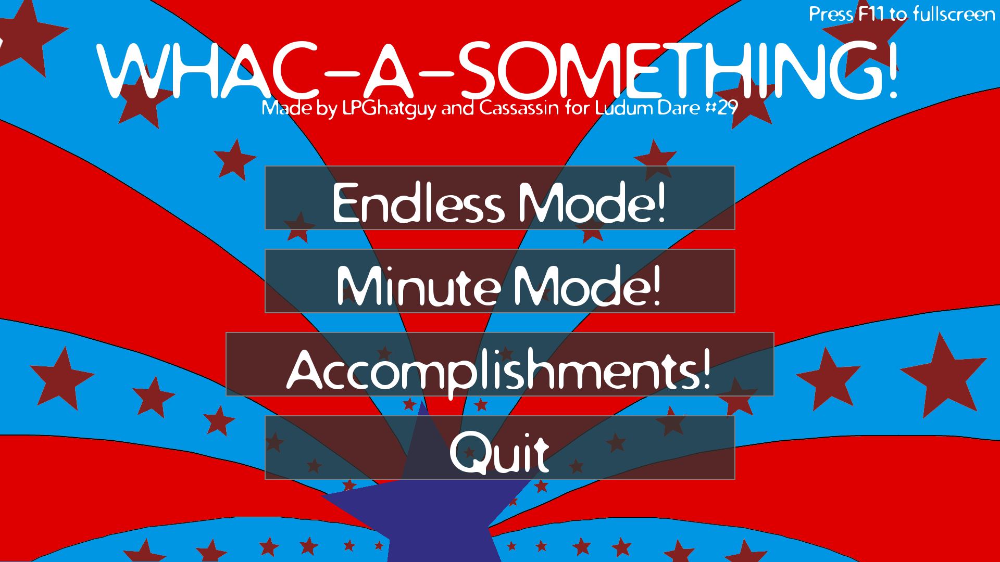
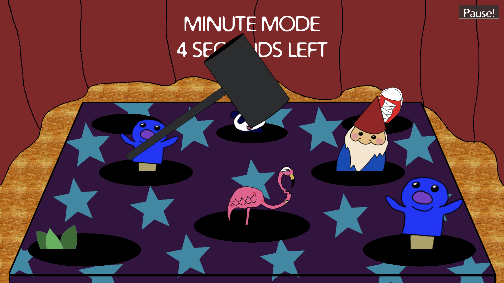

# [Ludum Dare 29: Whac-A-Something!](http://ludumdare.com/compo/ludum-dare-29/?action=preview&uid=14296)
This was my wife and I's entry for the Ludum Dare 29 Jam, which took place April 25th-28th 2014. The jam's theme was **Beneath the Surface**.

This game was built using [LÖVE](https://love2d.org/) 0.9.1.

Original submission description:

> LINUX USERS: download LOVE 0.9.1 from http://love2d.org/ and use it to run the .love file!
>
> It's time to Whac-A-Something!
>
> In this thriller of a game, you play the role of a giant metal hammer sent to crush everything! Hit anything that pops up with extreme prejudice to win!
>
> Whac-A-Something features two modes: minute mode and endless mode! Play minute mode if you just have, well a minute! Endless mode can go on forever, but don't expect to last forever!
>
> This was built by LPGhatguy and Cassassin!

Original submission screenshots:

## License
Whac-A-Something! is available under the terms of the MIT license. See [LICENSE.txt](LICENSE.txt) or <https://opensource.org/licenses/MIT> for details.